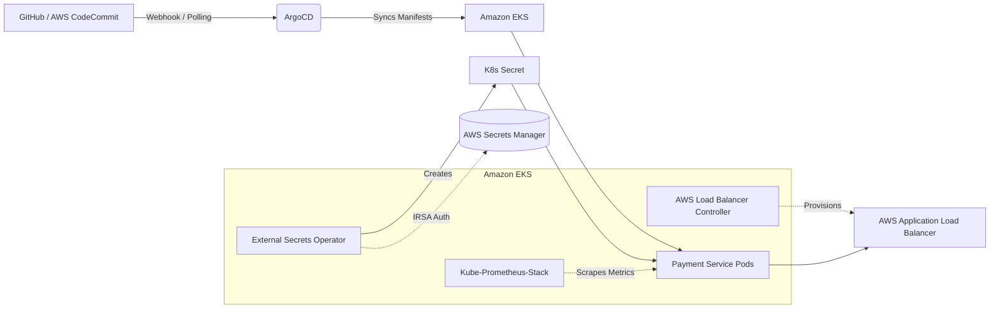

# Exercise 1 – EKS Application Deployment via GitOps


This repository contains the GitOps deployment configuration for the `payment-service` microservice on Amazon Elastic Kubernetes Service (EKS).

## 🎥 Demonstration Video
**[Click here to watch the full deployment demonstration!](#)** *(Replace this link with your actual screen recording URL)*

---

## 🏗️ Architecture

The deployment implements a fully automated GitOps pipeline using ArgoCD.



## 🚀 Key Requirements Met
- **Deployment**: Microservice deployed using a structured **Helm Chart**.
- **Continuous Delivery**: **ArgoCD** is configured with `Automated` sync policies and self-healing to ensure the cluster state always matches the repository.
- **Secrets Management**: Secrets are stored externally in **AWS Secrets Manager** and dynamically injected into the cluster using the **External Secrets Operator (ESO)**.
- **Security**: Authentication with AWS Secrets Manager and the AWS Load Balancer Controller is strictly handled using **IAM Roles for Service Accounts (IRSA)**. No static AWS credentials are used.
- **Ingress**: Traffic is securely routed to the service via an **Application Load Balancer (ALB)** provisioned automatically.
- **Observability**: A `ServiceMonitor` is included in the Helm chart, ensuring the microservice is automatically scraped by **Prometheus** and its metrics are visualized in **Grafana**.

---

## 📂 Repository Structure

```text
├── application.yaml                  # The ArgoCD Application manifest that bootstraps the deployment
└── payment-service-gitops/           # The Helm repository watched by ArgoCD
    └── payment-service/              # The Helm chart for payment-service
        ├── Chart.yaml                # Chart metadata
        ├── values.yaml               # Application configuration values
        └── templates/
            ├── deployment.yaml       # K8s Deployment mapping the ExternalSecret to ENV variables
            ├── ingress.yaml          # K8s Ingress configured with ALB annotations
            ├── service.yaml          # K8s Service
            ├── secretstore.yaml      # ESO SecretStore utilizing IRSA for authentication
            ├── externalsecret.yaml   # ESO ExternalSecret mapping AWS Secret to K8s Secret
            └── servicemonitor.yaml   # Prometheus ServiceMonitor for automatic metrics scraping
```

---

## 🛠️ Deployment Instructions

### 1. Prerequisites
Ensure you have the following installed on your EKS Cluster:
- ArgoCD
- AWS Load Balancer Controller
- External Secrets Operator
- Kube-Prometheus-Stack

### 2. Apply the ArgoCD Application
To bootstrap the entire microservice, you simply need to apply the ArgoCD `application.yaml` manifest. ArgoCD will take over and continuously sync the state.

```bash
kubectl apply -f application.yaml
```

### 3. Verify Deployment
Check the status of the ArgoCD sync:
```bash
kubectl get app payment-service -n argocd
```

Verify that the `ExternalSecret` successfully fetched the secret from AWS Secrets Manager:
```bash
kubectl get externalsecrets,secret -n payment-service
```

Get the URL of the provisioned AWS Application Load Balancer:
```bash
kubectl get ingress -n payment-service
```

---
*Developed for Exercise 1: EKS Application Deployment via GitOps*
